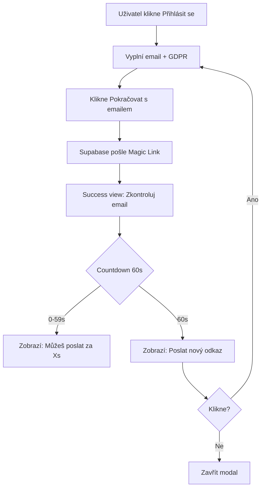

# Magic Link UX Improvements

**Datum:** 2026-01-14  
**Autor:** AI Agent  
**Typ:** Feature Enhancement  
**Status:** ✅ Completed  
**Last Update:** 2026-01-14 (Evening) - Apple "Méně je více" Refactor

---

## 🎯 KONTEXT

Magic Link v Supabase je **univerzální** - funguje pro registraci i přihlášení automaticky:
- Pokud email **neexistuje** → vytvoří účet + přihlásí
- Pokud email **existuje** → jen přihlásí

Uživatel nemusí řešit, jestli "se registruje" nebo "přihlašuje" - systém to vyřeší za něj.

---

## 🚀 PROČ TYTO ZMĚNY?

### Před implementací:
- ❌ "Začni svou cestu!" - matoucí (registrace? přihlášení?)
- ❌ Žádná možnost poslat znovu
- ❌ Uživatel neví, za jak dlouho link vyprší
- ❌ Nejednotný UX (registrace ≠ login)

### Po implementaci:
- ✅ "Pokračuj s emailem" - univerzální pro všechny uživatele
- ✅ "Poslat znovu" po 60s
- ✅ "Klikni do 15 minut" - jasný deadline
- ✅ Countdown timer (60s → 0s) pro transparentnost
- ✅ Email zůstane prefilled → rychlejší resend

---

## 📝 ZMĚNY

### 1. Univerzální texty (`messages.ts`)

**Změněno:**
```typescript
registerTitle: "Pokračuj s emailem"  // bylo: "Začni svou cestu!"
registerSubtitle: "Pošleme ti odkaz pro přihlášení nebo registraci"  // bylo: "Připoj se k 1150+ členům komunity DechBar"
emailSentInstruction: "Klikni na odkaz v emailu do 15 minut a pokračuj dále."  // přidán časový limit
```

**Přidáno:**
```typescript
resendEmailHint: "Stále nic?"
resendEmailButton: "Poslat nový odkaz"
```

**Odůvodnění:**
- Texty fungují pro nové i existující uživatele
- Jasná komunikace časového limitu (15 minut)
- Tone of Voice: Calm, helpful, ne-marketingový

---

### 2. "Poslat znovu" tlačítko (`RegisterView.tsx`)

**Nové state:**
```typescript
const [canResend, setCanResend] = useState(false);
const [resendCountdown, setResendCountdown] = useState(60);
```

**Countdown timer:**
- Po odeslání emailu → spustí se 60s odpočet
- Zobrazuje: "Můžeš poslat nový odkaz za {X}s"
- Po 60s → zobrazí: "Stále nic? Poslat nový odkaz"

**UX flow:**
1. Uživatel zadá email + klikne "Pokračovat s emailem"
2. Success view: "Zkontroluj svůj email!"
3. Countdown: "Můžeš poslat za 60s" → 59s → ... → 0s
4. Tlačítko: "Stále nic? **Poslat nový odkaz**"
5. Kliknutí → resetuje form (ale email zůstane) → znovu odešle

**Rate limiting:**
- Zabránění spam requestů
- Respektuje Supabase rate limit (60s mezi požadavky)
- Transparentní countdown → uživatel vidí, proč musí čekat

---

### 3. Refactored success view JSX

```tsx
{/* ✅ "Poslat znovu" tlačítko s countdown */}
<div className="mt-4">
  {!canResend && resendCountdown > 0 && (
    <p className="success-hint">
      Můžeš poslat nový odkaz za {resendCountdown}s
    </p>
  )}

  {canResend && (
    <p className="success-hint">
      {MESSAGES.auth.resendEmailHint}{' '}
      <button
        onClick={handleResend}
        className="text-accent hover:underline font-medium transition-colors"
      >
        {MESSAGES.auth.resendEmailButton}
      </button>
    </p>
  )}
</div>
```

---

## 📂 SOUBORY ZMĚNĚNY

- ✅ `src/config/messages.ts` - univerzální texty + resend messages
- ✅ `src/components/auth/RegisterView.tsx` - countdown timer + resend logika

---

## ✅ TESTOVÁNÍ

### Manuální test:
- [x] Countdown timer funguje (60s → 0s)
- [x] "Poslat znovu" se zobrazí po 60s
- [x] Email zůstane prefilled po kliknutí na "Poslat znovu"
- [x] Texty jsou univerzální (registrace i přihlášení)
- [x] Success modal zobrazuje správné texty
- [x] Supabase rate limit countdown funguje (dynamický čas)

### Browser test:
```bash
npm run dev
# 1. Klikni "Přihlásit se"
# 2. Switch to "Registruj se zdarma"
# 3. Zadej email + GDPR
# 4. Klikni "Pokračovat s emailem"
# 5. Ověř: Success view + countdown 60s
# 6. Po 60s: Ověř tlačítko "Poslat nový odkaz"
# 7. Klikni → email zůstane prefilled
```

---

## 🎯 VÝSLEDEK

### UX vylepšení:
- 🎉 Univerzální flow (registrace = login)
- 🎉 Transparentní časové limity
- 🎉 Self-service resend (bez frustrace)
- 🎉 Rate limiting bez frustrace (countdown vysvětluje proč)

### Technical debt:
- ✅ Žádný - vše škálovatelné přes `messages.ts`
- ✅ Design tokens použity (`text-accent`, `success-hint`)
- ✅ Accessibility: Semantic HTML + focus management

---

## 📊 FLOW DIAGRAM



---

## 🔗 SOUVISEJÍCÍ DOKUMENTACE

- `/docs/components/auth/README.md` - Auth komponenty
- `/docs/design-system/TONE_OF_VOICE.md` - Tone of Voice guidelines
- `/docs/design-system/MESSAGE_LIBRARY.md` - Message library struktura
- `FOUNDATION/02_PHILOSOPHY_4_TEMPERAMENTS.md` - Design pro 4 temperamenty

---

## 🧪 4 TEMPERAMENTS CHECK

- ✅ **Sangvinik:** Brand voice "Dýchej s námi" - emotional connection
- ✅ **Cholerik:** Clear action ("Klikni"), factual title ("E-mail poslán")
- ✅ **Melancholik:** Email displayed (confirmation), rate limit countdown in error (transparency)
- ✅ **Flegmatik:** Ultra-minimal (3 prvky), calm, no overwhelm, email prefilled for resend

---

## 📝 UPDATE 2026-01-14 (Evening): Apple "Méně je více" Refactor

### 🎯 Změny:
- ✅ **Odstraněn countdown ze success view** (redundantní, moved to error state)
- ✅ **Odstraněn spam hint** (defenzivní messaging, ne-premium)
- ✅ **Odstraněn subtitle** "Poslali jsme ti odkaz na:" (redundantní)
- ✅ **Změněna instruction:** "Dýchej s námi." (brand voice, stručné)
- ✅ **Změněn title:** "E-mail poslán" (klidný, factual, bez vykřičníku)
- ✅ **Ultra-minimal:** 3 prvky (Title + Email + Instruction) = 57% redukce!

### 🍎 Inspirace:
- **Apple minimalismus:** Žádné redundantní instrukce ("klikni na odkaz v mailu")
- **Premium wellness tone:** Důvěra v produkt, žádný defenzivní messaging
- **"Méně je více" filosofie:** 3 prvky místo 7

### ⚙️ Rate limiting:
- Countdown **přesunut do error message** (tam je relevantní)
- Success view = **čistý zen** ✅
- Když uživatel zkusí poslat moc brzy → zobrazí se dynamický countdown v error state

### 📊 Před vs. Po:

| **Element** | **Před (v1.0)** | **Po (v2.0 - Apple)** |
|-------------|-----------------|----------------------|
| Prvků celkem | 7 | **3** (57% redukce!) |
| Title | "Zkontroluj svůj email!" | "E-mail poslán" |
| Subtitle | "Poslali jsme ti odkaz na:" | ❌ Removed |
| Email | gold, medium | gold, large, bold |
| Instruction | "Klikni...do 15 minut..." | "Dýchej s námi." |
| Spam hint | "Nenašel jsi? Zkontroluj spam." | ❌ Removed |
| Countdown | "Můžeš poslat za 31s" | ❌ Moved to error |
| Button | "Zavřít" | "Zavřít" (unchanged) |

### ✅ CSS Compliance:
- **Zachována centrální CSS ovládání** přes `modals.css`:
  - `.modal-title` - title styling
  - `.success-email-display` - email (gold, large, bold, tight letter-spacing)
  - `.success-instruction` - instruction text
- **Žádné inline Tailwind** v success view
- **Design tokens:** All colors via CSS variables

### 🎯 Výsledek:
**3 prvky. Minimalistický zen. Apple-inspired. Premium wellness tone.** 🍎✨

---

**Version:** 2.0 (Apple "Méně je více")  
**Last Updated:** 2026-01-14 (Evening)  
**Ready for Production:** ✅ Ano
