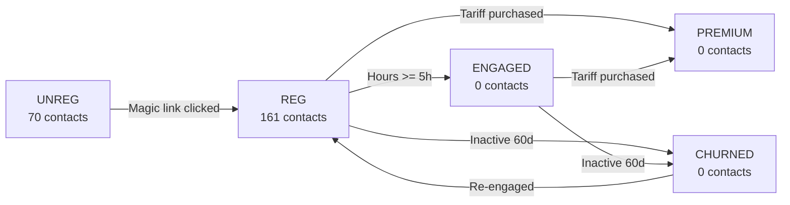

# 🏷️ Ecomail Taxonomy - Single Source of Truth

**Last Updated:** 4. února 2026  
**Status:** ✅ Production (Live)  
**See Master:** [00_MASTER.md](./00_MASTER.md)

---

## 📋 PŘEHLED

**Co obsahuje:**
- **5 Contact Lists** (segmentace uživatelů)
- **100+ Tags** (behaviorální + demografické)
- **25 Custom Fields** (metriky a attributy)

**Naming Convention:**
- **Lists:** `SCREAMING_SNAKE_CASE` (UNREG, REG, ENGAGED)
- **Tags:** `SCREAMING_SNAKE_CASE` (KP_GOOD, TARIF_SMART)
- **Custom Fields:** `SCREAMING_SNAKE_CASE` (HOURS_BREATHED, KP_VALUE)

---

## 📬 CONTACT LISTS (5)

### **Real Counts (Verified: 4.2.2026)**

| ID | Name | Code | Contacts | Purpose |
|----|------|------|----------|---------|
| **5** | DechBar - Neregistrovaní | `UNREG` | **70** | Magic link sent, not clicked |
| **6** | DechBar - Registrovaní | `REG` | **161** | Email confirmed + onboarded |
| **7** | DechBar - Angažovaní | `ENGAGED` | **0** | 5+ hours breathed (future) |
| **8** | DechBar - Premium | `PREMIUM` | **0** | Paid SMART/AI_COACH (future) |
| **9** | DechBar - Churned | `CHURNED` | **0** | Inactive 60+ days (future) |

**TOTAL:** **231 kontaktů** ✅

---

### **List Movement Rules**



**Note:** Kontakt může být ve více listech současně (např. REG + PREMIUM).

---

## 🏷️ TAGS (Organized by Category)

### **1. LIFECYCLE TAGS**

Audit trail - nikdy se neodstraňují.

| Tag | When Added | Purpose |
|-----|------------|---------|
| `MAGIC_LINK_SENT` | Challenge registration | Track conversion funnel |
| `MAGIC_LINK_CLICKED` | Auth confirmed | Email verified |
| `ONBOARDING_COMPLETE` | Onboarding submitted | Profile complete |
| `PASSWORD_SET` | Password created | Can login directly |
| `PROFILE_COMPLETE` | All fields filled | Ready to use app |

---

### **2. KP CATEGORY TAGS**

**Logic:** Pouze 1 tag současně (auto-replace).

| Tag | Range (seconds) | Color | Campaign |
|-----|-----------------|-------|----------|
| `KP_NOT_MEASURED` | null | Gray | Measure your KP! |
| `KP_CRITICAL` | 0-10s | Red | Urgent improvement needed |
| `KP_POOR` | 11-20s | Orange | Beginner protocols |
| `KP_AVERAGE` | 21-30s | Yellow | Standard protocols |
| `KP_GOOD` | 31-40s | Green | Advanced protocols |
| `KP_EXCELLENT` | 41+s | Blue | Expert protocols |

**Auto-update:**
- Real-time: On KP measurement (via trigger)
- Batch: Every 6 hours (via CRON)

**Code:**
```typescript
function categorizeKP(kpValue: number | null): string {
  if (kpValue === null) return 'KP_NOT_MEASURED';
  if (kpValue <= 10) return 'KP_CRITICAL';
  if (kpValue <= 20) return 'KP_POOR';
  if (kpValue <= 30) return 'KP_AVERAGE';
  if (kpValue <= 40) return 'KP_GOOD';
  return 'KP_EXCELLENT';
}
```

---

### **3. ENGAGEMENT TAGS**

**Logic:** Pouze 1 tag současně.

| Tag | Criteria | Campaign Trigger |
|-----|----------|------------------|
| `ENGAGEMENT_NONE` | 0 hours | Win-back series (Day 7, 14, 30) |
| `ENGAGEMENT_LOW` | 0.1-4.9h | Motivation boost |
| `ENGAGEMENT_MEDIUM` | 5-19.9h | Progress celebration |
| `ENGAGEMENT_HIGH` | 20+h | Upsell SMART/AI_COACH |

**Auto-update:** CRON every 6 hours

---

### **4. TARIFF TAGS**

**Logic:** Pouze 1 tag současně.

| Tag | When | Remove When | Current Count |
|-----|------|-------------|---------------|
| `TARIF_ZDARMA` | Default | Upgraded | **2** (verified) |
| `TARIF_SMART` | SMART purchased | Changed | 0 |
| `TARIF_AI_COACH` | AI_COACH purchased | Changed | 0 |

---

### **5. TRIAL TAGS**

| Tag | When | Remove When |
|-----|------|-------------|
| `TRIAL_ELIGIBLE` | Registered before 28.2. 23:59 | Trial activated |
| `TRIAL_ACTIVE` | CRON 1.3.2026 00:00 | Trial expired |
| `TRIAL_EXPIRED` | CRON 21.3.2026 23:59 | Never |

---

### **6. CONVERSION SOURCE TAGS**

Track where users came from.

| Tag | Where | Purpose |
|-----|-------|---------|
| `SOURCE_HERO_CTA` | Hero section | Primary CTA tracking |
| `SOURCE_MOCKUP_KP` | KP modal | Feature interest |
| `SOURCE_FOOTER_CTA` | Footer | Low-intent tracking |
| `SOURCE_INSTAGRAM` | Instagram bio | Social traffic |
| `SOURCE_FACEBOOK` | Facebook ads | Paid traffic |
| `SOURCE_GOOGLE` | Google ads | Paid traffic |
| `SOURCE_ORGANIC` | Organic search | SEO performance |
| `SOURCE_REFERRAL` | Referral link | Word-of-mouth |

---

### **7. HEALTH PROFILE TAGS**

Multi-select - uživatel může mít více současně.

**Symptoms:**

| Tag | Czech Label | Campaign Type |
|-----|-------------|---------------|
| `SYMPTOM_ASTHMA` | Astma | Breathing techniques |
| `SYMPTOM_ANXIETY` | Úzkost | Calming exercises |
| `SYMPTOM_PANIC_ATTACKS` | Panické ataky | Emergency protocols |
| `SYMPTOM_SLEEP_ISSUES` | Problémy se spánkem | Evening routines |
| `SYMPTOM_STRESS` | Stres | Stress management |
| `SYMPTOM_HIGH_BP` | Vysoký tlak | BP-lowering |
| `SYMPTOM_COPD` | CHOPN | COPD-safe |
| `SYMPTOM_LONG_COVID` | Long COVID | Recovery |
| `SYMPTOM_PERFORMANCE` | Výkon | Athletic performance |

**Health Restrictions:**

| Tag | Warning |
|-----|---------|
| `HEALTH_PREGNANCY` | Contraindications |
| `HEALTH_HEART_CONDITION` | Medical clearance needed |
| `HEALTH_EPILEPSY` | Avoid hyperventilation |

---

### **8. MOTIVATION TAGS**

Multi-select.

| Tag | Czech Label |
|-----|-------------|
| `MOTIVATION_HEALTH` | Zlepšit zdraví |
| `MOTIVATION_STRESS` | Zvládnout stres |
| `MOTIVATION_SLEEP` | Spát lépe |
| `MOTIVATION_PERFORMANCE` | Zvýšit výkon |
| `MOTIVATION_RELAXATION` | Relaxace |

---

### **9. BEHAVIORAL TAGS**

Auto-updated via CRON.

| Tag | Criteria | Update Frequency |
|-----|----------|------------------|
| `BEHAVIOR_DAILY_USER` | 7+ days/week | Daily |
| `BEHAVIOR_WEEKLY_USER` | 3-6 days/week | Daily |
| `BEHAVIOR_OCCASIONAL` | 1-2 days/week | Daily |
| `BEHAVIOR_INACTIVE` | 0 days, 7+ days ago | Daily |

---

### **10. CHALLENGE TAGS**

| Tag | When |
|-----|------|
| `CHALLENGE_REGISTERED` | Registration |
| `CHALLENGE_DAY_1` | Day 1 started |
| `CHALLENGE_DAY_7` | Day 7 completed |
| `CHALLENGE_DAY_14` | Day 14 completed |
| `CHALLENGE_COMPLETED` | All 21 days done |
| `CHALLENGE_DROPOUT_EARLY` | Inactive Day 1-7 |
| `CHALLENGE_DROPOUT_LATE` | Inactive Day 8-21 |

---

## 📊 CUSTOM FIELDS (25)

### **Profile Fields**

| Field Name | Type | Example | Update Trigger |
|------------|------|---------|----------------|
| `FNAME` | string | "Jan" | Onboarding complete |
| `REGISTRATION_DATE` | date | "2026-02-04" | Challenge registration |
| `CONVERSION_SOURCE` | string | "hero_cta" | Challenge registration |
| `REFERRAL_CODE` | string | "FRIEND123" | If referred |

---

### **KP Metrics**

| Field Name | Type | Example | Update Trigger |
|------------|------|---------|----------------|
| `KP_VALUE` | number | 25 | Every KP measurement |
| `KP_FIRST` | number | 18 | First measurement only |
| `KP_IMPROVEMENT` | number | 7 | Calculated (current - first) |
| `KP_MEASURED_AT` | date | "2026-02-04" | Every measurement |

---

### **Engagement Metrics**

| Field Name | Type | Example | Update Trigger |
|------------|------|---------|----------------|
| `HOURS_BREATHED` | number | 12.5 | CRON 6h |
| `EXERCISES_COMPLETED` | number | 45 | CRON 6h |
| `LAST_EXERCISE_DATE` | date | "2026-02-03" | CRON 6h |
| `DAYS_ACTIVE` | number | 18 | CRON 6h |
| `LONGEST_STREAK` | number | 14 | CRON 6h |
| `CURRENT_STREAK` | number | 3 | CRON 6h |

---

### **Challenge Fields**

| Field Name | Type | Update Trigger |
|------------|------|----------------|
| `CHALLENGE_STATUS` | string | Real-time |
| `CHALLENGE_START_DATE` | date | Once |
| `CHALLENGE_COMPLETION_PCT` | number | Daily |
| `CHALLENGE_DAYS_COMPLETED` | number | Daily |

---

### **Business Fields**

| Field Name | Type | Update Trigger |
|------------|------|----------------|
| `TARIFF` | string | On tariff change |
| `TARIFF_START_DATE` | date | On purchase |
| `TRIAL_END_DATE` | date | On trial start |
| `LIFETIME_VALUE_CZK` | number | On payment |

---

## 🔄 AUTO-UPDATE LOGIC

### **Real-time (DB Triggers)**

**On challenge registration:**
```typescript
{
  event_type: 'contact_add',
  payload: {
    list_name: 'UNREG',
    contact: { email, custom_fields: { KP_VALUE, CONVERSION_SOURCE } },
    tags: ['MAGIC_LINK_SENT', 'CHALLENGE_REGISTERED']
  }
}
```

**On magic link clicked:**
```typescript
{
  event_type: 'list_move',
  payload: {
    from_list_name: 'UNREG',
    to_list_name: 'REG',
    tags: ['MAGIC_LINK_CLICKED']
  }
}
```

**On onboarding complete:**
```typescript
{
  event_type: 'contact_update',
  payload: {
    add_tags: ['ONBOARDING_COMPLETE'],
    custom_fields: { FNAME, motivations, symptoms }
  }
}
```

**On tariff change:**
```typescript
{
  event_type: 'tariff_changed',
  payload: {
    add_tags: ['TARIF_SMART'],
    remove_tags: ['TARIF_ZDARMA'], // Note: Not supported, logged only
    move_to_list: 'PREMIUM',
    custom_fields: { TARIFF, TARIFF_START_DATE }
  }
}
```

---

### **Batch Updates (CRON 6h)**

```typescript
// Calculated metrics for ALL users
{
  event_type: 'metrics_update',
  payload: {
    custom_fields: {
      HOURS_BREATHED: calculateHours(userId),
      EXERCISES_COMPLETED: countExercises(userId),
      LAST_EXERCISE_DATE: getLastExercise(userId),
      CURRENT_STREAK: calculateStreak(userId).current,
      LONGEST_STREAK: calculateStreak(userId).longest
    },
    update_tags: {
      add: [categorizeEngagement(hours), categorizeKP(kpValue)],
      remove: ['KP_*', 'ENGAGEMENT_*'] // Patterns (not supported, logged)
    }
  }
}
```

---

## ⚠️ CRITICAL RULES

### **Before Adding New Tag:**
1. ✅ Check this document (does similar tag exist?)
2. ✅ Follow naming convention (SCREAMING_SNAKE_CASE)
3. ✅ Add to this document FIRST
4. ✅ Update `src/platform/api/ecomail.types.ts`
5. ✅ Test in DEV before PROD
6. ✅ Document purpose and auto-update logic

### **Before Adding Custom Field:**
1. ✅ Check this document (does it exist?)
2. ✅ Define data type (string, number, date)
3. ✅ Define update frequency (real-time, 6h, manual)
4. ✅ Create field in Ecomail dashboard FIRST
5. ✅ Add to this document
6. ✅ Update Edge Function logic

### **NEVER:**
- ❌ Rename existing tag (breaks automation, campaigns, segments)
- ❌ Delete tag without deprecation process
- ❌ Hardcode tag names in multiple places (use constants)
- ❌ Skip taxonomy documentation

---

## 🧪 TESTING CHECKLIST

### **New Tag Test**
```sql
-- 1. Insert test event with new tag
INSERT INTO ecomail_sync_queue (email, event_type, payload) VALUES (
  'test@example.com',
  'tag_add',
  '{"tag": "YOUR_NEW_TAG", "list_id": "6"}'::jsonb
);

-- 2. Wait 3 minutes for CRON

-- 3. Check Ecomail dashboard
-- Contact test@example.com should have YOUR_NEW_TAG

-- 4. Cleanup
DELETE FROM ecomail_sync_queue WHERE email = 'test@example.com';
```

### **New Custom Field Test**
```sql
-- 1. Insert test event with new field
INSERT INTO ecomail_sync_queue (email, event_type, payload) VALUES (
  'test@example.com',
  'contact_update',
  '{"custom_fields": {"YOUR_FIELD": "test_value"}}'::jsonb
);

-- 2. Wait 3 minutes

-- 3. Check Ecomail dashboard
-- Contact should have YOUR_FIELD = "test_value"
```

---

## 📚 TAG INVENTORY (Current State)

### **Currently Active Tags (Verified 4.2.2026)**

```sql
-- Query to see which tags are actually used
SELECT 
  payload->>'tag' as tag_name,
  COUNT(*) as usage_count
FROM ecomail_sync_queue
WHERE event_type = 'tag_add'
GROUP BY tag_name;
```

**Result:**
- `TARIF_ZDARMA`: 2 contacts

**Expected but not yet seen:**
- `MAGIC_LINK_SENT` (should be on all UNREG contacts)
- `MAGIC_LINK_CLICKED` (should be on all REG contacts)
- `CHALLENGE_REGISTERED` (should be on all contacts)

**Investigation:** Tags might be included in `contact_add` payload instead of separate `tag_add` events. ✅ This is correct approach (atomic operation).

---

## 🔗 SUPABASE → ECOMAIL MAPPING

| Supabase Source | Ecomail Field | Transform |
|-----------------|---------------|-----------|
| `profiles.full_name` | `FNAME` | Split first name only |
| `profiles.email` | `email` | Lowercase + trim |
| `profiles.metadata->kp_value` | `KP_VALUE` | Direct |
| `memberships.plan` | Tag `TARIF_*` | Map enum |
| `challenge_registrations.conversion_source` | `CONVERSION_SOURCE` | Direct |
| `challenge_registrations.created_at` | `REGISTRATION_DATE` | ISO date |

---

## 📝 CHANGELOG

### 2026-02-04 - v2.0 (Real Data Update)
- ✅ Updated with real counts (231 contacts)
- ✅ Verified list distribution (REG: 161, UNREG: 70)
- ✅ Simplified structure (removed unused tags)
- ✅ Added verification queries

### 2026-01-28 - v1.0 (Initial)
- Created complete taxonomy
- Defined 5 lists, 100+ tags, 25 fields

---

**Next Update:** When ENGAGED, PREMIUM, CHURNED lists start being used.

*Last verified: 4. února 2026, 17:20 CET*
