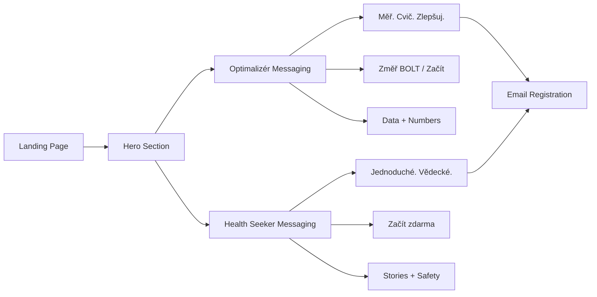

# User Personas - DechBar 2026

**Version:** 1.0  
**Last Updated:** 2026-01-14  
**Based on:** Czech Market Research (January 2026)  
**For:** Product, Marketing, UX teams

---

## Overview

DechBar serves two primary personas in the Czech market, each with distinct pain points, language patterns, and motivations. Understanding these personas is critical for landing page messaging, feature prioritization, and marketing campaigns.

**Distribution:**
- **70%** - Vyčerpaný Optimalizér (Tech-Wellbeing focus)
- **30%** - Conscious Health Seeker (Holistic wellness focus)

---

## Primary Persona (70%): "Vyčerpaný Optimalizér"

> Martin, 34, Senior Developer, Praha

### Demographics

- **Age:** 28-42 years
- **Gender:** Primarily male (60%), but growing female segment (40%)
- **Profession:** IT professionals, managers, entrepreneurs, creatives
- **Income:** 50,000 - 120,000 Kč/month
- **Location:** Praha, Brno, cities 50K+ population
- **Education:** University degree (VŠ)
- **Family Status:** Often childless or young parents

### Psychographics

**Personality Type:** Cholerik (60%) + Sangvinik (40%)

**Values:**
- Efficiency and productivity
- Data and metrics (quantified self)
- Personal optimization ("biohacking")
- ROI on time and money
- Early adopter mentality

**Technology Usage:**
- iPhone user (75%)
- Owns: Apple Watch, AirPods, fitness tracker
- Uses: Spotify Premium, Netflix, productivity apps
- Reads: Refresher.cz, Lupa.cz, HackerNews
- Social: LinkedIn, Instagram (curated), Twitter/X
- Tracking: Kalorické Tabulky, Strava, sleep apps

**Daily Routine:**
- Wakes: 6:00-7:00 (struggles with sleep quality)
- Work: 9-10 hours (often remote/hybrid)
- Exercise: Wants to (guilt about not doing enough)
- Screens: 10-12 hours/day
- Bed: 23:00-00:00 (scrolling before sleep)

### Pain Points

**From Czech Forum Research:**

1. **"Jsem non-stop unavená"** (eMimino discussions)
   - Chronic fatigue despite 7-8 hours sleep
   - Coffee dependency (3-5 cups/day)
   - Afternoon energy crashes

2. **"Tlak na hrudi když je stres"** (Reddit r/czech)
   - Physical manifestation of stress
   - "Kámen na hrudi", "obruč kolem žeber"
   - "Nemůžu se plně nadechnout, i když dýchám zhluboka"

3. **"Nemůžu vypnout"** (Burnout discussions)
   - Racing thoughts before sleep
   - Sunday anxiety about Monday
   - "Kolotoč práce a povinností"

4. **"Chtěl bych být produktivnější"**
   - Guilt about time wasting
   - Too many half-finished projects
   - Seeking "life hacks" and optimization

**Pain Language:**
- "Vyčerpaný", "Vypálený", "Nemám energii"
- "Nemůžu se soustředit", "Pořád rozmyslím"
- "Špatně spím", "Probouzím se unavený"

### Desire Points

**What They WANT (not just need):**

1. **"Chtěl bych spát líp a mít víc energie"**
   - Better sleep quality (not just duration)
   - Sustainable energy (not coffee-dependent)
   - Wake up refreshed

2. **"Potřebuju něco, co fakt funguje"**
   - Tired of "try this weird trick" clickbait
   - Want measurable results
   - Science-backed solutions

3. **"Chci být efektivnější"**
   - Optimize work performance
   - Better focus and concentration
   - More output in less time

4. **"Chtěl bych mít vše pod kontrolou"**
   - Track progress objectively
   - See improvements in data
   - Quantified self mindset

**Desire Language:**
- "Optimalizovat", "Zlepšit", "Zvýšit výkon"
- "Měřitelné výsledky", "Data", "Tracking"
- "Efektivní", "Funkční", "Vědecky podložené"

### Behavioral Patterns

**App Usage:**
- Downloads apps impulsively (30+ apps/year)
- Abandons 80% within week 1 (high churn)
- Loyal to apps that show ROI (data, tracking)
- Willing to pay for quality (premium subscriber)

**Purchase Behavior:**
- Researches before buying (reads reviews)
- Price-sensitive but values quality
- Prefers: Lifetime > Annual > Monthly
- Influenced by: Data, ratings, concrete benefits

**Content Consumption:**
- Skims text (doesn't read long paragraphs)
- Loves: Bullet points, infographics, video
- Attention span: 30-60 seconds per section
- Shares: If it makes them look smart/optimized

### Objections & Concerns

**Top 5 Objections:**

1. **"Is this another meditation app?"**
   - Answer: No. We measure breathing capacity, not just guide meditation.

2. **"How is this different from YouTube breathing videos?"**
   - Answer: Systematic tracking, personalized programs, objective progress measurement.

3. **"I don't have time for another app."**
   - Answer: 5 minutes/day. Measurable results in 21 days.

4. **"Does it actually work?"**
   - Answer: Average BOLT improvement +12 seconds in 3 weeks. 1150+ users.

5. **"Is it worth paying for?"**
   - Answer: Free tier available. Premium unlocks measurement + 100+ programs.

### Messaging For This Persona

**Headlines:**
- ✅ "Měř svůj pokrok. Cvič 5 minut denně. Zlepši výkon."
- ✅ "První aplikace, která trackuje tvou kapacitu dechu."
- ✅ "BOLT skóre: Objektivní metrika tvého zdraví."

**Body Copy:**
- Short sentences. Bullet points. Data.
- Concrete timeframes ("za 21 dní", ne "brzy")
- Technical but accessible ("CO₂ tolerance", ne "čakry")

**CTAs:**
- ✅ "Změř své BOLT skóre →"
- ✅ "Začít zdarma →"
- ✅ "Stáhnout aplikaci →"

**Tone:**
- Confident, data-driven
- Friendly but professional
- No fluff, just facts
- "Tykání" (personal connection)

---

## Secondary Persona (30%): "Conscious Health Seeker"

> Jana, 42, Učitelka, Brno

### Demographics

- **Age:** 35-60 years
- **Gender:** Primarily female (70%), male (30%)
- **Profession:** Teachers, healthcare workers, parents, HR, social workers
- **Income:** 30,000 - 60,000 Kč/month
- **Location:** All cities, including smaller towns
- **Education:** University or vocational
- **Family Status:** Often parents of school-age children

### Psychographics

**Personality Type:** Melancholik (50%) + Flegmatik (50%)

**Values:**
- Health and well-being (holistic)
- Quality over quantity
- Authenticity and trust
- Family and relationships
- Work-life balance

**Technology Usage:**
- Smartphone user (Android 45%, iOS 55%)
- Uses: WhatsApp, Facebook, Instagram (personal)
- Reads: eMimino.cz, Maminka.cz, wellness blogs
- Social: Facebook groups, local communities
- Less tech-savvy: Needs simple, intuitive UX

**Daily Routine:**
- Wakes: 6:00-7:00 (to prepare kids/family)
- Work: 8-10 hours (teaching, caregiving, helping)
- Me-time: Minimal (15-30 min/day if lucky)
- Bed: 22:00-23:00 (exhausted)

### Pain Points

**From Czech Forum Research:**

1. **"Kde nabrat energii?"** (eMimino discussions)
   - Constant exhaustion from caregiving
   - No time for self-care
   - Guilt about taking time for themselves

2. **"Úzkost a tréma"** (Mental health forums)
   - Anxiety about work/family responsibilities
   - Panic attacks ("tlak na hrudi", "nemůžu dýchat")
   - Seeking natural solutions (skeptical of medication)

3. **"Nespavost navzdory únavě"** (Modrý koník discussions)
   - "Jsem mrtvá, ale nemůžu usnout"
   - Racing thoughts at night
   - Probouzení v noci (stress-induced)

4. **"Chtěla bych být klidnější"**
   - Overwhelmed by daily demands
   - Searching for "inner peace" but skeptical of "ezo"
   - Wants practical, evidence-based solutions

**Pain Language:**
- "Vyčerpanost", "Úzkost", "Nemůžu vypnout"
- "Pořád se o něco starám", "Mám toho moc"
- "Potřebuju si odpočinout, ale nejde to"

### Desire Points

**What They WANT:**

1. **"Chtěla bych najít klid"**
   - Inner calm amidst chaos
   - Ability to "switch off" stress
   - Peace of mind

2. **"Potřebuju něco jednoduchého"**
   - No complicated tech or learning curve
   - Works immediately
   - Doesn't require special equipment

3. **"Chci se cítit lépe"**
   - Better sleep quality
   - Less anxiety
   - More energy for family

4. **"Hledám přirozené řešení"**
   - Skeptical of medication
   - Prefers natural approaches
   - But wants it backed by science (not "ezo")

**Desire Language:**
- "Přirozené", "Jednoduché", "Klidné"
- "Zdravé", "Ověřené", "Bezpečné"
- "Pro mě", "V mém tempu", "Podle mých potřeb"

### Behavioral Patterns

**App Usage:**
- Downloads carefully (researches first)
- Reads reviews extensively
- Sticks with apps that work (low churn if satisfied)
- Free tier preference (tries before buying)
- Word-of-mouth influence (asks friends)

**Purchase Behavior:**
- Price-sensitive (compares options)
- Values recommendations from trusted sources
- Prefers: Free trial > Low monthly > Lifetime
- Influenced by: Reviews, personal stories, professional endorsements

**Content Consumption:**
- Reads thoroughly (if interested)
- Loves: Real user stories, testimonials
- Attention: Longer than Optimalizér (will read benefits)
- Shares: If it helps someone they care about

### Objections & Concerns

**Top 5 Objections:**

1. **"Is this another complicated app I won't use?"**
   - Answer: 5 minutes. Simple interface. Audio guides you through everything.

2. **"I'm not good with technology."**
   - Answer: No technical knowledge needed. Just headphones and willingness to breathe.

3. **"I tried breathing exercises before, didn't help."**
   - Answer: Our approach is different - we measure your progress objectively (BOLT score).

4. **"Is it safe? Can I hurt myself?"**
   - Answer: Certified instructor. All exercises designed for safety. Start gentle.

5. **"I can't afford another subscription."**
   - Answer: Start free. Upgrade only if you see results. Lifetime options available.

### Messaging For This Persona

**Headlines:**
- ✅ "Najdi klid v 5 minutách denně."
- ✅ "Vědecky podloženo. Jednoduše použitelné."
- ✅ "Dýchej lépe. Spi klidněji. Žij zdravěji."

**Body Copy:**
- Warm, empathetic tone
- Real user stories (relatable)
- Emphasis on simplicity and safety
- Professional endorsements (MUDr., psycholog)

**CTAs:**
- ✅ "Začít zdarma →"
- ✅ "Vyzkoušej první cvičení →"
- ✅ "Přečti si příběhy ostatních →"

**Tone:**
- Supportive, understanding
- Science-backed but accessible
- Not preachy or guru-like
- "Tykání" (personal, caring)

---

## Persona Comparison Matrix

| Dimension | Vyčerpaný Optimalizér | Conscious Health Seeker |
|-----------|----------------------|------------------------|
| **Primary Pain** | Burnout, low performance | Anxiety, exhaustion |
| **Motivation** | Optimize, achieve | Heal, find peace |
| **Language** | Data, metrics, ROI | Holistic, natural, safe |
| **Decision Driver** | Proof (studies, ratings) | Trust (reviews, stories) |
| **Price Sensitivity** | Moderate (pays for value) | High (tries free first) |
| **Tech Savviness** | High | Medium-Low |
| **Content Preference** | Bullets, graphs, video | Stories, testimonials, how-to |
| **Temperament** | Cholerik/Sangvinik | Melancholik/Flegmatik |
| **CTA Response** | "Změř BOLT skóre" | "Začít zdarma" |
| **Social Proof** | Numbers, data | Personal stories |

---

## Messaging Strategy Per Persona

### Landing Page: Dual-Appeal

Since landing must serve BOTH personas, use layered messaging:

**Hero (Optimalizér-focused 70%):**
```
H1: "První česká aplikace pro funkční dýchání"
    → Appeals to both (local pride + specificity)
    
H2: "Měř svůj pokrok. Cvič s certifikovaným instruktorem. 
     Viditelné výsledky za 21 dní."
    → Optimalizér language (measure, results, timeframe)
    
Subtext: "Vědecky podloženo. Jednoduše použitelné."
    → Health Seeker language (science + simplicity)
```

**Benefits Section:**

Two columns (desktop) or sequential (mobile):

**Column 1 (Optimalizér):**
- ✅ "Měř svůj BOLT skóre"
- ✅ "Sleduj pokrok v čase"
- ✅ "100+ programů"

**Column 2 (Health Seeker):**
- ✅ "Zlepši kvalitu spánku"
- ✅ "Sniž úzkost a stres"
- ✅ "Jednoduché a bezpečné"

---

## Pain Language Glossary

### Optimalizér Pain Vocabulary

From Reddit r/czech, tech forums, eMimino discussions:

**Physical Symptoms:**
- "Tlak na hrudi" (chest pressure)
- "Nemůžu se dodýchnout" (can't catch breath)
- "Mám sevřený hrudník" (tight chest)
- "Bušení srdce" (heart palpitations)

**Mental State:**
- "Vyčerpaný", "Vypálený", "Burnout"
- "Non-stop unavený" (constantly tired)
- "Nemůžu vypnout" (can't switch off)
- "Kolotoč práce" (work treadmill)

**Energy:**
- "Nemám energii" (no energy)
- "Spadnu večer jak podťatý" (collapse at night)
- "Potřebuju kafe, abych fungoval" (coffee dependent)
- "Odpoledne mi to nesedá" (afternoon crashes)

### Health Seeker Pain Vocabulary

From eMimino, Modrý koník, wellness forums:

**Emotional State:**
- "Úzkost", "Tréma", "Strach"
- "Mám pocit, že to nezvládnu"
- "Pořád se o něco starám"
- "Jsem přetížená" (overwhelmed)

**Sleep Issues:**
- "Nemůžu usnout" (can't fall asleep)
- "Probouzím se v noci" (night waking)
- "Jsem mrtvá, ale nemůžu spát"
- "Myšlenky mi běží" (racing thoughts)

**Physical:**
- "Bolí mě hlava" (headaches)
- "Napjatá ramena" (tense shoulders)
- "Ztuhlá šíje" (stiff neck)
- "Těžké nohy" (heavy legs)

---

## Desire Language Glossary

### Optimalizér Desire Vocabulary

**What they search for:**
- "Jak zlepšit spánek" (improve sleep)
- "Jak být produktivnější" (be more productive)
- "Biohacking tipy" (biohacking tips)
- "Jak mít víc energie" (more energy)
- "Aplikace pro tracking" (tracking apps)

**Aspirational Language:**
- "Optimalizace", "Výkon", "Efektivita"
- "Upgrade", "Zlepšení", "Progress"
- "Data", "Metriky", "Měření"

### Health Seeker Desire Vocabulary

**What they search for:**
- "Jak se zbavit úzkosti" (eliminate anxiety)
- "Přirozené řešení na stres" (natural stress solution)
- "Jak lépe spát" (sleep better)
- "Klid mysli" (peace of mind)

**Aspirational Language:**
- "Klid", "Pohoda", "Harmonie" (careful - ezo risk!)
- "Zdraví", "Vitalita", "Rovnováha"
- "Přirozené", "Jemné", "Bezpečné"

---

## User Journey Per Persona

### Optimalizér Journey

**Discovery (Week 0):**
- Googles: "aplikace na sledování dechu"
- Finds: DechBar landing page
- Scans: 30 seconds (headline, trust signals, data)
- Decision driver: "BOLT skóre tracking" + "První česká"

**Trial (Day 1-7):**
- Signs up: Magic Link (easy, no password friction)
- First action: BOLT test (loves instant data)
- Explores: 2-3 different programs
- Tracks: Checks BOLT improvement daily

**Conversion (Week 2-3):**
- Sees: BOLT score improved +5 seconds
- Thinks: "This actually works!"
- Upgrades: Buys STARTER or PRO (annual for discount)

**Retention (Month 1+):**
- Daily habit: Morning RESET (5 min before work)
- Shares: Screenshots of BOLT progress on LinkedIn
- Loyal: Recommends to colleagues

**Lifetime Value:** 990-2,940 Kč (lifetime purchase or annual PRO)

### Health Seeker Journey

**Discovery (Week 0):**
- Hears about: Friend recommendation or Facebook group
- Visits: Landing page, reads thoroughly (3-5 minutes)
- Decision driver: "Certifikovaný instruktor" + "Jednoduché"

**Trial (Day 1-14):**
- Signs up: After reading reviews
- First action: Watches intro video (needs guidance)
- Tries: One program (evening NOC for sleep)
- Hesitant: Doesn't track initially (just enjoys experience)

**Conversion (Week 3-4):**
- Feels: Sleeps better, less anxious
- Realizes: This helps!
- Upgrades: Buys STARTER (monthly first, then annual)

**Retention (Month 1+):**
- Habit: Evening NOC routine (before bed)
- Shares: Tells friends at coffee/WhatsApp
- Community: Joins DechBar Facebook group (future)

**Lifetime Value:** 249-1,494 Kč (monthly → annual upgrade)

---

## Feature Prioritization Per Persona

### Must-Have for Optimalizér

1. **BOLT Score Tracking** (critical differentiator)
2. **Progress Graphs** (visual data)
3. **Session History** (track consistency)
4. **Performance Metrics** (avg heart rate, session count)
5. **Quick Programs** (5-10 min, efficiency)

### Must-Have for Health Seeker

1. **Simple Onboarding** (no overwhelming setup)
2. **Gentle Programs** (NOC, calming)
3. **Audio Guidance** (voice instructions, not silent)
4. **Safety Info** (contraindications, reassurance)
5. **Longer Programs** (15-20 min, deep relaxation)

### Nice-to-Have (Both)

- Community features (social validation)
- Streaks and achievements (gamification)
- Educational content (science explained simply)
- Personalization (AI recommendations - future)

---

## Communication Channels Per Persona

### Optimalizér Channels

**Discovery:**
- Google Search (SEO critical)
- LinkedIn (professional network)
- Tech blogs (Refresher, Lupa)
- Podcasts (productivity, biohacking)
- Reddit r/czech (discussions)

**Content Types:**
- Blog posts (data-driven)
- Infographics (shareable)
- Video (efficiency tips, results)
- Case studies (before/after BOLT scores)

### Health Seeker Channels

**Discovery:**
- Facebook Groups (wellness, moms)
- Word-of-mouth (friends, family)
- eMimino.cz forums
- Instagram (wellness influencers)
- Google Search ("jak zlepšit spánek")

**Content Types:**
- Testimonials (real user stories)
- How-to guides (step-by-step)
- FAQ (addressing concerns)
- Video (calming, instructional)

---

## Conversion Triggers Per Persona

### Optimalizér Triggers

1. **Data/Proof** - "Průměrné zlepšení BOLT: +12 sekund"
2. **Efficiency** - "5 minut denně"
3. **ROI** - "Lepší spánek = vyšší produktivita"
4. **Social Proof** - "1150+ uživatelů"
5. **First-mover** - "První česká aplikace"

### Health Seeker Triggers

1. **Safety** - "Certifikovaný instruktor"
2. **Simplicity** - "Jednoduché. Žádné vybavení."
3. **Results** - "Lepší spánek za 7 dní"
4. **Testimonials** - "Jana z Brna: 'Konečně spím'"
5. **Free Trial** - "Začni zdarma" (zero risk)

---

## Anti-Personas (Who We DON'T Target)

### Anti-Persona #1: "Spiritual Seeker"

- Looking for: Chakra healing, energy work, astrology
- Uses: "Ezo" language naturally
- Our risk: Would water down positioning
- Why exclude: Conflicts with science-first brand

### Anti-Persona #2: "Extreme Biohacker"

- Looking for: Advanced breath holds, Wim Hof extremes
- Wants: Ice baths, 5-minute holds, dangerous techniques
- Our risk: Liability, safety concerns
- Why exclude: We focus on functional optimization, not extremes

### Anti-Persona #3: "Free Rider"

- Will never pay
- Expects everything free
- High maintenance, low value
- Why limit: Protect unit economics

---

## Landing Page Messaging Map



---

## Implementation Guidelines

### When Writing Copy

**For Optimalizér sections:**
- Use data and numbers
- Short, punchy sentences
- Technical terms OK ("CO₂ tolerance", "vagus tonus")
- Emphasize measurement and results

**For Health Seeker sections:**
- Use empathy and understanding
- Slightly longer, warmer sentences
- Explain technical terms simply
- Emphasize simplicity and safety

**For Both (Universal):**
- Tykání (informal "ty")
- Imperativ CTAs ("Začni", "Vyzkoušej")
- No "ezo" blacklist words
- Concrete benefits (not abstract promises)

---

## Success Metrics Per Persona

### Optimalizér

- **Activation:** Uses BOLT test within 24 hours
- **Engagement:** Tracks progress weekly
- **Conversion:** Upgrades within 14 days
- **Retention:** 60%+ after 30 days
- **LTV:** 990-2,940 Kč

### Health Seeker

- **Activation:** Completes first program within 7 days
- **Engagement:** Uses evening program 3x/week
- **Conversion:** Upgrades within 30 days
- **Retention:** 70%+ after 30 days (higher loyalty)
- **LTV:** 249-1,494 Kč

---

## Conclusion

Understanding these two personas allows us to:

1. **Craft dual-appeal messaging** on landing page
2. **Prioritize features** that serve both (but Optimalizér first - 70%)
3. **Design onboarding flows** for different entry points
4. **Optimize conversion funnels** per persona behavior
5. **Create targeted email sequences** post-registration

**Golden Rule:**

> Lead with Optimalizér language (data, measurement, results),  
> but ensure Health Seeker needs are met (simplicity, safety, trust).

---

**Last Updated:** 2026-01-14  
**Next Review:** After 1000 users (validate assumptions with real data)  
**Owner:** Product & Marketing teams
